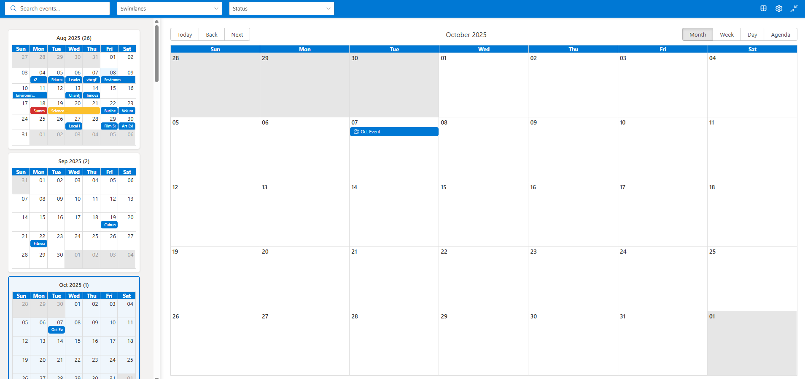
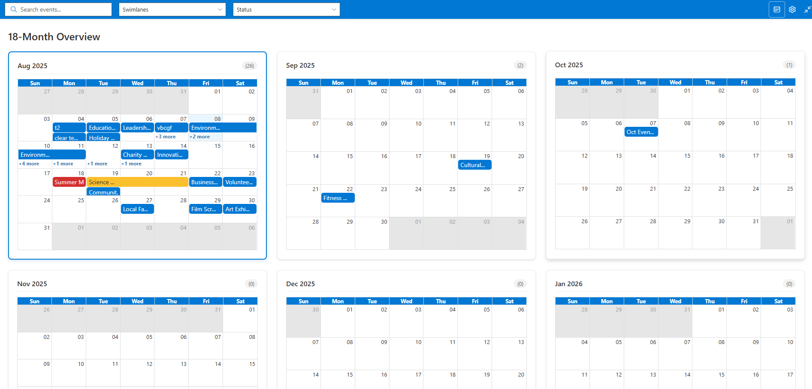
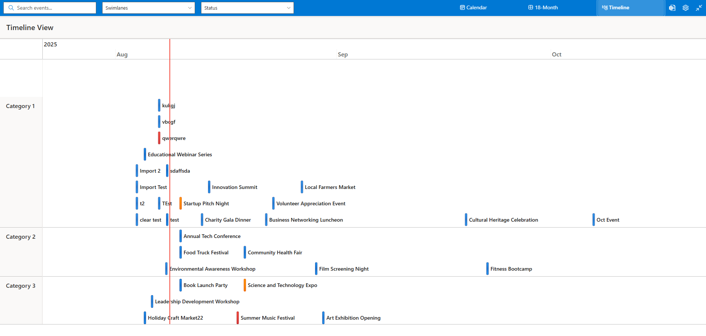
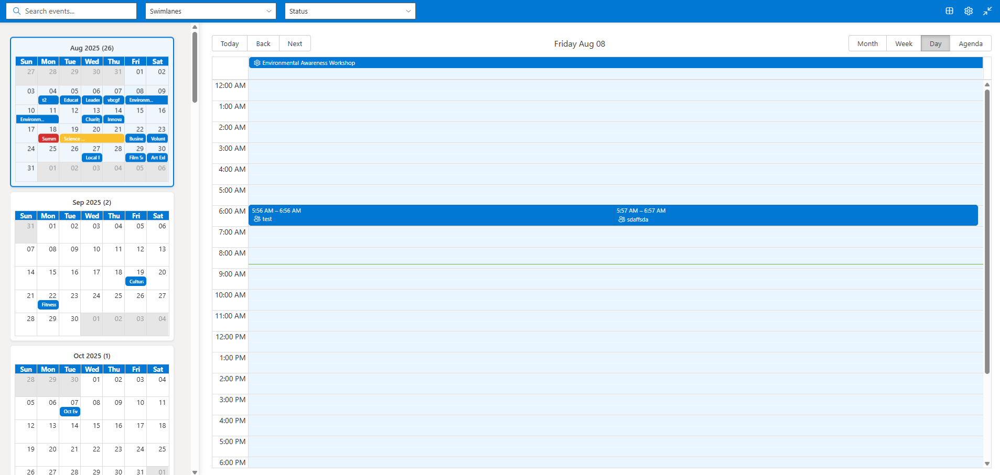
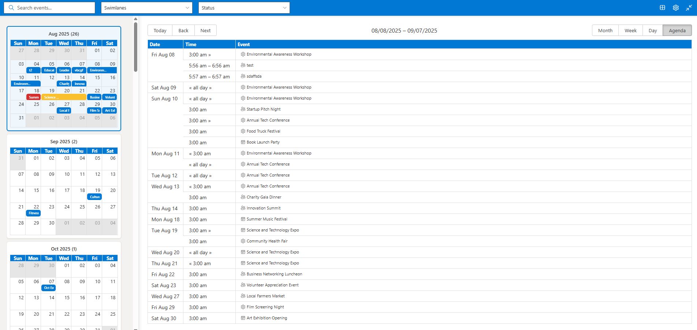
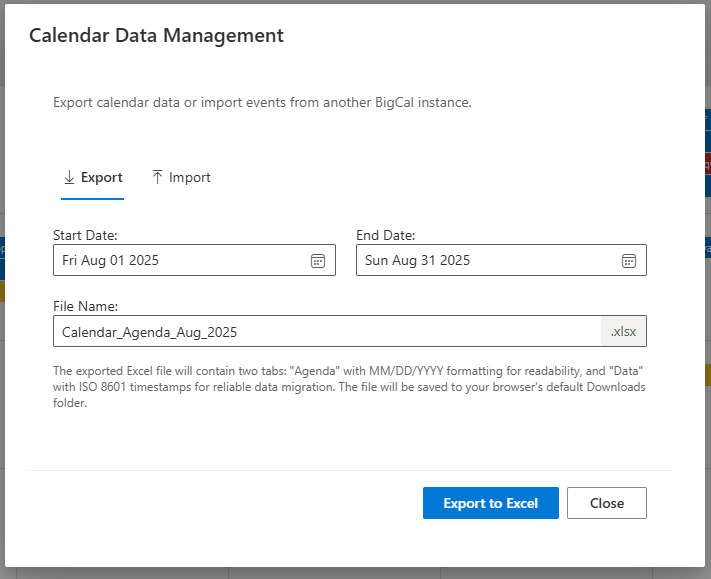
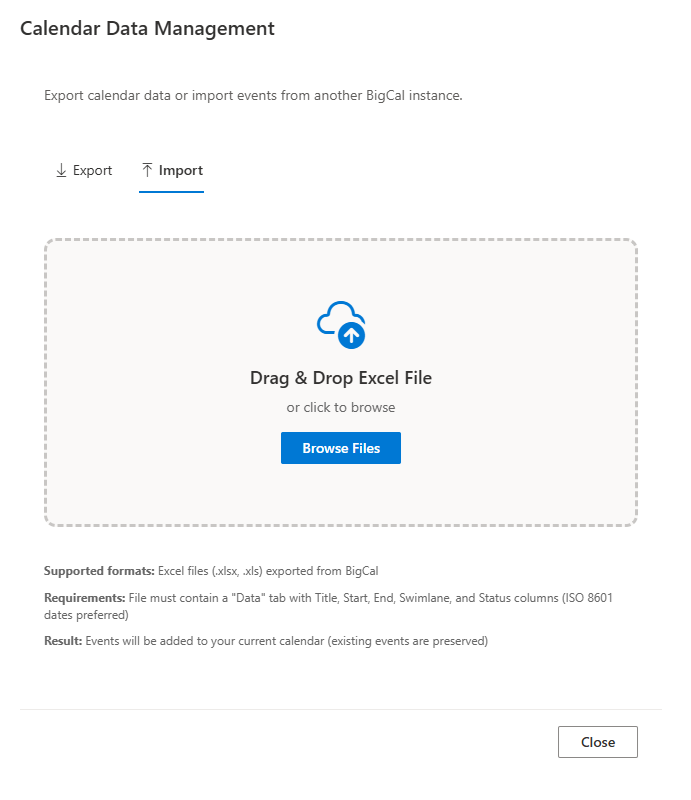
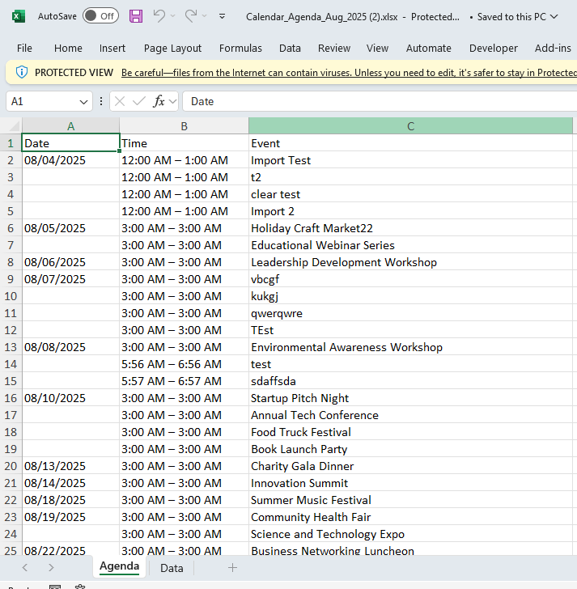
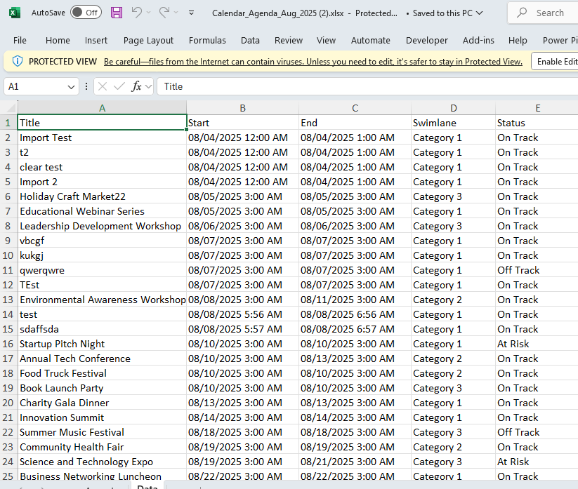

# 🗓️ BigCal - Advanced SharePoint Calendar Solution

> **Transform your team's planning with the most powerful 18-month calendar experience for SharePoint**

[](https://docs.microsoft.com/en-us/sharepoint/dev/spfx/sharepoint-framework-overview)
[](https://www.typescriptlang.org/)
[](https://reactjs.org/)
[](https://developer.microsoft.com/en-us/fluentui)

## ✨ **Why BigCal?**

BigCal revolutionizes SharePoint calendar management by providing **dual-view planning capabilities** that scale from daily task management to strategic 18-month planning. Built with modern React and Fluent UI, it delivers enterprise-grade performance with consumer-grade usability.


*Full-featured calendar with advanced filtering, 18-month navigation, and professional event management*

## 🎯 **Core Features**

### 🔄 **Triple View System**
Switch seamlessly between detailed calendar management, strategic overview, and timeline visualization:

| **📅 Calendar View** | **📊 Grid View** | **⏱️ Timeline View** |
|---------------------|------------------|---------------------|
|  |  |  |
| *Detailed event management with 18-month sidebar navigation* | *Strategic 18-month overview with large, readable calendars* | *Interactive timeline with swimlane organization* |

### 🗓️ **Multiple Calendar Views**
Choose the perfect view for your workflow:

| **📋 Week View** | **📝 Day View** | **📑 Agenda View** |
|------------------|-----------------|-------------------|
|  |  |  |
| *Weekly planning with time slots* | *Detailed daily scheduling* | *Clean event list overview* |

### 📊 **Excel Import/Export System**
Complete data management for enterprise migration and backup:

| **📤 Export Interface** | **📥 Import Interface** |
|------------------------|------------------------|
|  |  |
| *Dual-tab exports with custom date ranges and filenames* | *Drag & drop import with professional feedback* |

| **📋 Agenda Tab** | **📊 Data Tab** |
|------------------|-----------------|
|  |  |
| *Human-readable format for reports and sharing* | *Machine-readable format for data migration* |

### 🎯 **Advanced Features**

#### 🔍 **Smart Filtering System**
- **🔎 Global Search** - Find events across all 18 months instantly
- **🏊 Swimlane Categories** - Organize by project, team, or department with visual icons
- **📊 Status Tracking** - Color-coded progress indicators (On Track, At Risk, Off Track)
- **📈 Real-time Counts** - See filtered results and event density immediately

#### ⏱️ **Interactive Timeline View**
- **🎯 Swimlane Organization** - Events grouped by categories with visual separation
- **🎨 Status-based Color Coding** - Instant visual status recognition
- **🖱️ Advanced Interactions** - Smooth scrolling, zooming, and navigation
- **📅 Smart Loading** - Professional loading states with vis.js event detection
- **⚡ Responsive Design** - Optimized for all screen sizes and touch devices

#### 📊 **Excel Import/Export System**
- **📤 Dual-tab Exports** - Agenda (human-readable) + Data (machine-readable) tabs
- **📅 Smart Date Formatting** - MM/DD/YYYY HH:MM AM/PM for reliable data migration
- **🎯 Month-based Defaults** - Export defaults to current calendar month view
- **📝 Custom Filenames** - Full control over export file naming
- **📥 Drag & Drop Import** - Professional import interface with visual feedback
- **🔄 Round-trip Accuracy** - Perfect data preservation for migration scenarios

#### 🗓️ **18-Month Navigation**
- **📅 Mini Calendar Sidebar** - Navigate any month with one click
- **🎯 Current Month Highlighting** - Always know your current position
- **📊 Event Density Visualization** - See event counts for each month
- **⚡ Instant Navigation** - Jump to any month from grid or sidebar

#### 🎨 **Professional Design**
- **🌈 Status Color Coding** - Visual indicators throughout the interface
- **🎨 Fluent UI Integration** - Native SharePoint look and feel
- **📱 Responsive Design** - Perfect experience on all devices
- **⚡ Smooth Animations** - Polished interactions and transitions

## 🚀 **Quick Start**

### Prerequisites
- SharePoint Online or SharePoint 2019+
- Node.js 16+ and npm
- SharePoint Framework development environment
- [SharePoint Framework development environment](https://docs.microsoft.com/en-us/sharepoint/dev/spfx/set-up-your-developer-tenant)

### Installation

```bash
# Clone the repository
git clone https://github.com/yourusername/BigCal.git
cd BigCal

# Install dependencies
npm install

# Build the solution
npm run build

# Package for deployment
gulp package-solution --ship
```

### Deployment
1. Upload the `.sppkg` file to your SharePoint App Catalog
2. Deploy the solution to your tenant
3. Add the BigCal web part to any SharePoint page
4. Configure your event sources and start planning!

## 🛠️ **Technical Excellence**

### 🏗️ **Modern Architecture**
- **⚡ React 17** - Component-based architecture with hooks
- **📘 TypeScript 4.7** - Type-safe development with strict linting
- **🎨 Fluent UI 8.x** - Native SharePoint design system
- **📅 React Big Calendar** - Powerful, flexible calendar engine
- **⏱️ vis.js Timeline** - Interactive timeline visualization with advanced controls
- **📊 xlsx Library** - Professional Excel import/export capabilities
- **🔧 SPFx 1.20** - Latest SharePoint Framework capabilities

### 🎯 **Performance Optimized**
- **⚡ Efficient Rendering** - Smart event filtering and virtualization
- **📱 CSS Grid Layout** - Responsive design with auto-fit columns
- **🔄 Optimized State** - Minimal re-renders with React best practices
- **💾 Memory Efficient** - Handles 1000+ events smoothly across 18 months
- **⏱️ Smart Loading States** - Event-driven loading with vis.js integration
- **📊 Optimized Excel Processing** - Efficient large dataset import/export

### 🔒 **Enterprise Ready**
- **🛡️ SharePoint Security** - Inherits all SharePoint permissions and authentication
- **🎨 Theme Integration** - Automatically adapts to your SharePoint theme
- **📱 Mobile Optimized** - Touch-friendly interface for all devices
- **♿ Accessibility** - WCAG 2.1 AA compliant with keyboard navigation

## 🎨 **Customization & Configuration**

### 🏊 **Swimlane Categories**
Easily customize categories with icons and colors:

```typescript
// Customize in BigCal.tsx
private getSwimlaneIcon = (swimlane: string): string => {
  switch (swimlane) {
    case 'Development': return 'Code';
    case 'Marketing': return 'Megaphone';
    case 'Sales': return 'Money';
    case 'Operations': return 'Settings';
    default: return 'Calendar';
  }
};
```

### 📊 **Status Indicators**
Configure status colors and icons:

```typescript
// Modify status system in BigCal.tsx
private getStatusColor = (status: string): string => {
  switch (status) {
    case 'On Track': return '#0078d4';    // SharePoint Blue
    case 'At Risk': return '#FBC02D';     // Warning Amber
    case 'Off Track': return '#D32F2F';   // Error Red
    case 'Completed': return '#107C10';   // Success Green
    default: return '#605e5c';            // Neutral Gray
  }
};
```

### 🎯 **Event Management**
- **✏️ Quick Event Creation** - Click any date to create events
- **📝 Rich Event Details** - Title, description, status, and category
- **🎨 Visual Status Indicators** - Color-coded events throughout all views
- **🔄 Real-time Updates** - Changes reflect immediately across all views

## 🎯 **Use Cases & Benefits**

### 👥 **Perfect for Teams**
- **📋 Project Management** - Track milestones across multiple projects with timeline view
- **🎯 Sprint Planning** - Visualize development cycles and releases
- **📅 Event Coordination** - Manage company events, meetings, and deadlines
- **📊 Resource Planning** - See team availability and workload distribution
- **🔄 Data Migration** - Seamlessly move calendar data between environments

### 🏢 **Enterprise Benefits**
- **📈 Strategic Planning** - 18-month visibility for long-term initiatives
- **🔍 Quick Discovery** - Find any event across 1.5 years instantly
- **📱 Mobile Productivity** - Full functionality on phones and tablets
- **🎨 Brand Consistency** - Matches your SharePoint theme automatically
- **📊 Data Portability** - Complete import/export system for enterprise migration
- **⏱️ Timeline Visualization** - Professional project timeline views

### 🚀 **Developer Benefits**
- **⚡ Modern Stack** - React 17, TypeScript 4.7, latest SPFx
- **🛠️ Extensible** - Easy to customize and extend
- **📚 Well Documented** - Comprehensive documentation and examples
- **🧪 Test Ready** - Built with testing and CI/CD in mind

## 📚 **Documentation**

### 📋 **Core Documentation**
- [📋 SharePoint Fields Integration](docs/SharePoint-Fields-Integration.md)
- [⚙️ ESLint Configuration](docs/ESLint-Configuration.md)
- [📘 TypeScript Best Practices](docs/TypeScript-Best-Practices.md)

### ⏱️ **Timeline View Documentation**
- [🎯 vis.js Timeline Implementation Guide](docs/vis-timeline-implementation-guide.md)
- [🖱️ Timeline Zoom & Scroll Interactions](docs/vis-timeline-zoom-scroll-interactions-guide.md)

### 📊 **Import/Export Features**
- **Excel Export**: Dual-tab system with Agenda (human-readable) and Data (machine-readable) formats
- **Excel Import**: Drag & drop interface with comprehensive data validation
- **Data Migration**: Complete round-trip accuracy for enterprise scenarios
- **Date Formatting**: Standardized MM/DD/YYYY HH:MM AM/PM format for reliability

## 🤝 **Contributing**

We welcome contributions! Here's how to get started:

1. **🍴 Fork** the repository
2. **🌿 Create** a feature branch (`git checkout -b feature/amazing-feature`)
3. **✨ Make** your changes with tests
4. **📝 Commit** your changes (`git commit -m 'Add amazing feature'`)
5. **🚀 Push** to the branch (`git push origin feature/amazing-feature`)
6. **🎯 Open** a Pull Request

## 📄 **License**

This project is licensed under the MIT License - see the [LICENSE](LICENSE) file for details.

### Used SharePoint Framework Version


### Applies to
- [SharePoint Framework](https://aka.ms/spfx)
- [Microsoft 365 tenant](https://docs.microsoft.com/en-us/sharepoint/dev/spfx/set-up-your-developer-tenant)
- SharePoint Online
- SharePoint 2019+

> Get your own free development tenant by subscribing to [Microsoft 365 developer program](http://aka.ms/o365devprogram)

### References
- [Getting started with SharePoint Framework](https://docs.microsoft.com/en-us/sharepoint/dev/spfx/set-up-your-developer-tenant)
- [Building for Microsoft teams](https://docs.microsoft.com/en-us/sharepoint/dev/spfx/build-for-teams-overview)
- [Use Microsoft Graph in your solution](https://docs.microsoft.com/en-us/sharepoint/dev/spfx/web-parts/get-started/using-microsoft-graph-apis)
- [Publish SharePoint Framework applications to the Marketplace](https://docs.microsoft.com/en-us/sharepoint/dev/spfx/publish-to-marketplace-overview)
- [Microsoft 365 Patterns and Practices](https://aka.ms/m365pnp) - Guidance, tooling, samples and open-source controls for your Microsoft 365 development

## 🙏 **Acknowledgments**

- **Microsoft SharePoint Framework** - For the amazing development platform
- **Fluent UI Team** - For the beautiful, accessible design system
- **React Big Calendar** - For the powerful, flexible calendar engine
- **SharePoint Community** - For inspiration, feedback, and continuous improvement

## 📞 **Support & Community**

- **🐛 Found a bug?** [Report it here](https://github.com/yourusername/BigCal/issues)
- **💡 Have an idea?** [Request a feature](https://github.com/yourusername/BigCal/issues)
- **💬 Need help?** [Join the discussion](https://github.com/yourusername/BigCal/discussions)
- **📧 Enterprise support?** Contact us for professional services

## 🌟 **What's Next?**

BigCal is actively developed with exciting features planned:

- **🔗 Microsoft Graph Integration** - Sync with Outlook calendars
- **📊 Advanced Analytics** - Event trends and team productivity insights
- **🤖 AI-Powered Scheduling** - Smart conflict detection and suggestions
- **📱 Teams Integration** - Native Microsoft Teams calendar sync
- **🎨 Custom Themes** - Brand-specific color schemes and layouts
- **⏱️ Enhanced Timeline Features** - Gantt chart capabilities and dependency tracking
- **📊 Advanced Import/Export** - Support for additional formats and bulk operations

---

<div align="center">

### **⭐ Star this repo if BigCal transforms your team's planning! ⭐**

**Built with ❤️ for the SharePoint community**

[🐛 Report Bug](https://github.com/yourusername/BigCal/issues) • [✨ Request Feature](https://github.com/yourusername/BigCal/issues) • [💬 Discussions](https://github.com/yourusername/BigCal/discussions)

</div>

**THIS CODE IS PROVIDED _AS IS_ WITHOUT WARRANTY OF ANY KIND, EITHER EXPRESS OR IMPLIED, INCLUDING ANY IMPLIED WARRANTIES OF FITNESS FOR A PARTICULAR PURPOSE, MERCHANTABILITY, OR NON-INFRINGEMENT.**
